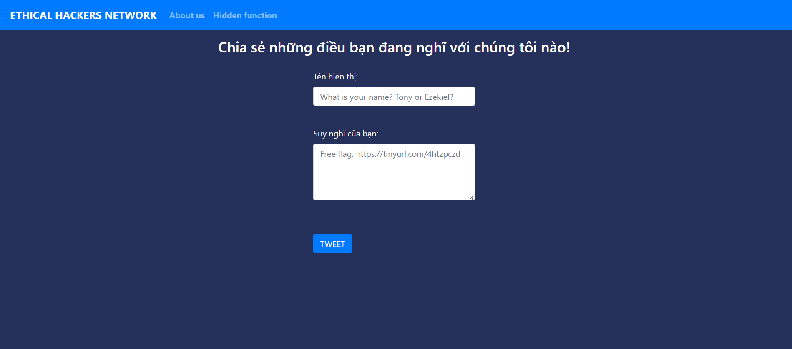
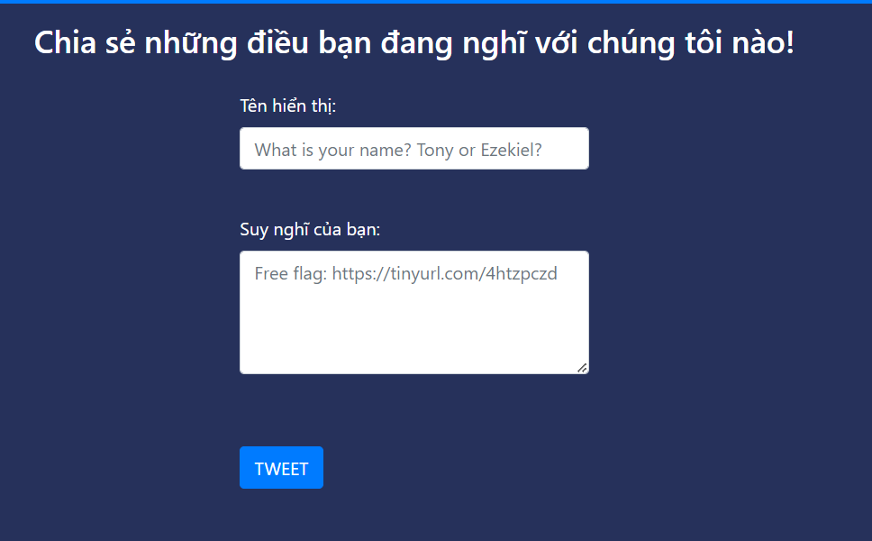
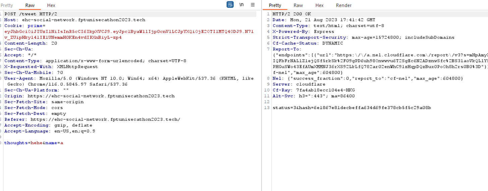
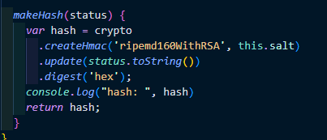
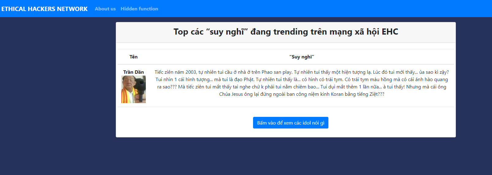
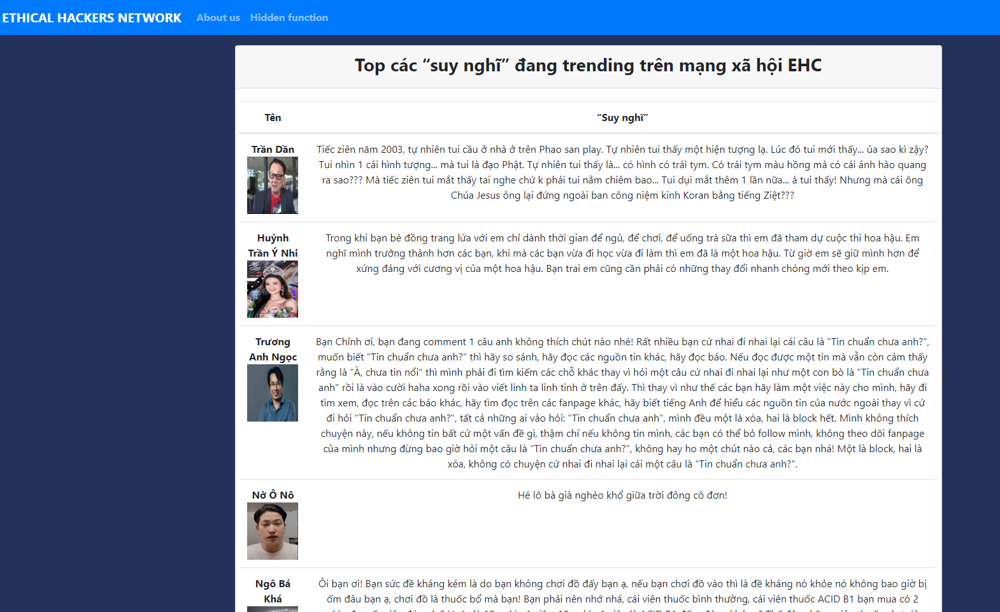
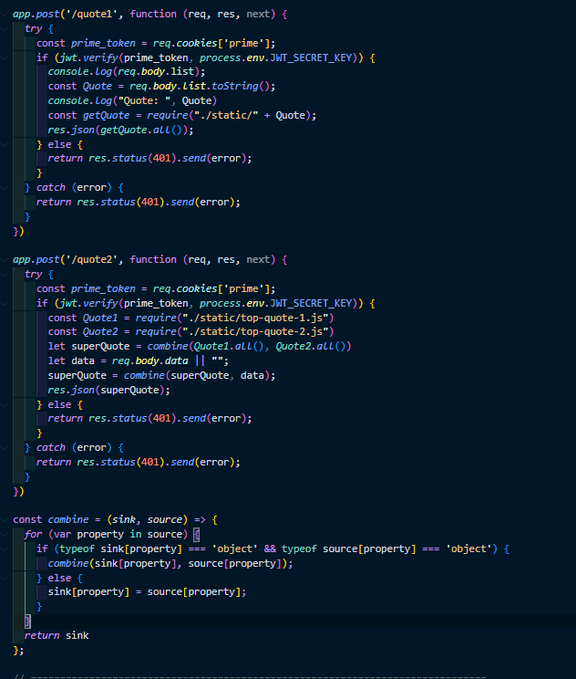
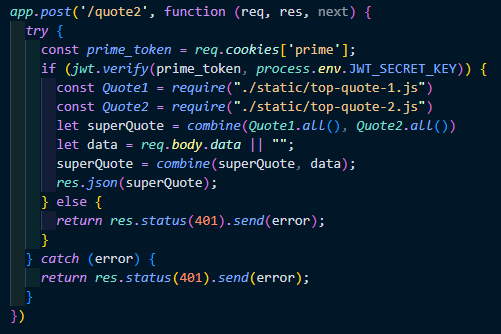
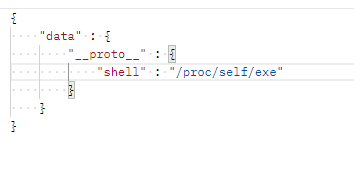

# EHC Social Network

Đây là bài về lỗi prototype pollution 

## Description
- Link: https://ehc-social-network.fptunisecathon2023.tech/
- Source code: [source code](./src)
- Ảnh: 

## Part 1: IDOR 
Bài này cho source code khá dài, cùng với 1 số tính năng, mình sẽ tóm tắt lại những điểm quan trọng nhất.



Đây là tính năng đầu tiên, bạn sẽ tạo 1 tweet, khi tạo xong sẽ redirect tới trang hiển thị nội dung tweet.



`status` chính là số thứ tự của tweet vừa tạo trong mảng tweet, hash là giá trị của `status` sau khi được mã hóa bằng hàm `makeHash`.



Điều đáng chú ý là khi start server, một tweet sẽ được tạo sẵn, với status là 0, nội dung của tweet là flag của part 1. 


Cách duy nhất để lấy flag chính là tìm cách lấy được hash của tweet với status 0 này.

Ban đầu, khi mới đọc thoáng qua code, mình cảm thấy lấy được hash của tweet là điều không thể, vì hàm hash đã được thêm salt random vào, và mình không thể biết được giá trị của salt này. Tuy nhiên khi nhìn kỹ hơn, chúng ta có thể thấy, phần tạo salt có vẻ chưa được code 1 cách chuẩn chỉ cho lắm


```salt-${crypto.randomBytes(10).toString}``` luôn trả về 1 giá trị duy nhất do hàm toString không được gọi đúng cách trên mỗi phiên bản của Node. Điều này đã được mình kiểm chứng bằng cách start server trên local nhiều lần thì giá trị salt không thay đổi.

Từ đó, chúng ta sẽ sửa source code ở local và tìm cách lấy được hash của tweet với status 0.


Call tới api /get_tweet với status=0 và hash=1aceba1a720b2e9284eea7d9f5c7cb18b390d195 sẽ trả về nội dung của tweet với status=0.


## Part 2: Prototype Pollution


Đây là endpoint thứ 2, mình sẽ nhập flag của part 1 vào, và lên prime :)) 




Đoạn code kiểm tra flag của part 1.

Sau khi "Bấm vào để xem các idol nói gì", sẽ có danh sách 1 list các câu nói của idol mạng xuất hiện.



Đây là đoạn code để lấy danh sách các câu nói của idol mạng xuất hiện.


Tài liệu về prototype pollution:
<ul>
  <li><a href="https://book.hacktricks.xyz/pentesting-web/deserialization/nodejs-proto-prototype-pollution" target="_blank">Doc 1</a></li>
  <li><a href="https://book.hacktricks.xyz/pentesting-web/deserialization/nodejs-proto-prototype-pollution/prototype-pollution-to-rce" target="_blank">Doc 2</a></li>
</ul>

Để tóm tắt lại, thì prototype pollution là 1 lỗi xảy ra khi chúng ta có thể thay đổi các thuộc tính của object prototype, từ đó có thể thay đổi các thuộc tính của object kế thừa từ object prototype đó.

Trong tài liệu, có chỉ ra 3 trường hợp có thể dẫn tới prototype pollution, và ở bài này, đoạn code bị dính nằm ở trường hợp: `Perform recursive merge`


Đoạn code này được call ở function xử lý cho endpoint `/quote2`. Vì vậy, chúng ta sẽ tìm cách để thực hiện prototype pollution ở đây.



Hàm `combine` bị lỗi được truyền 2 parameter là `superQuote` được merge 2 file `top-quote-1.js` và `top-quote-2.js` và `data` được truyền từ client.

Cộng thêm với việc ở api `/quote1`, chúng ta có thể sử dụng hàm require để require 1 file bất kì, chúng ta sẽ có hướng exploit như sau.

Đầu tiên, sử dụng api `/quote2` để pollute prototype của Object trong javascript, sau đó sử dụng api `/quote1` để require 1 file js bất kì trong hệ thống có chứa hàm `child_process`, từ đó có thể RCE.

Cụ thể các bạn hãy đọc trong 2 link mà mình đã mention ở phía trên để hiểu rõ hơn, mình sẽ trình bày payload của mình.

1. Mình đã vào môi trường ở máy local, tìm được file thỏa mãn yêu cầu là file `/usr/local/lib/node_modules/npm/scripts/changelog.js`. Đây là file có chứa đoạn code cần thiết để RCE.


2. Xác định được hàm sẽ thực thi đoạn code để RCE là hàm `execSync` của module `child_process`. Chúng ta sẽ tiến hành pollute prototype của Object bằng cách gửi request tới api `/quote2` với data là 1 object có key là `__proto__` và value là các object có key và value như hình

  

3. Gửi request tới api `/quote1` với data là 
```
{
    "list": "../../../../usr/local/lib/node_modules/npm/scripts/changelog.js"
}
```
và chúng ta có reverse shell.


cuối cùnglấy được flag nhờ execute file getFlag

